# Nexus Research System Architecture

**Visual guide to the Nexus superintelligent research system**

---

## 🏗️ System Overview

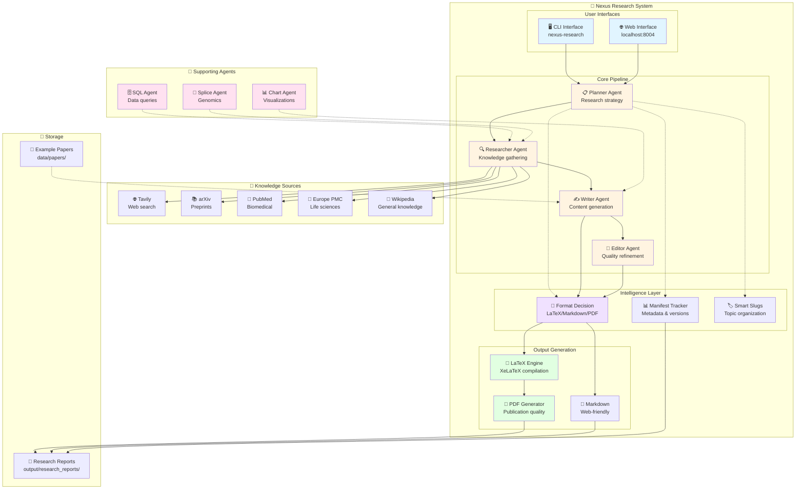

---

## 🔄 Research Workflow

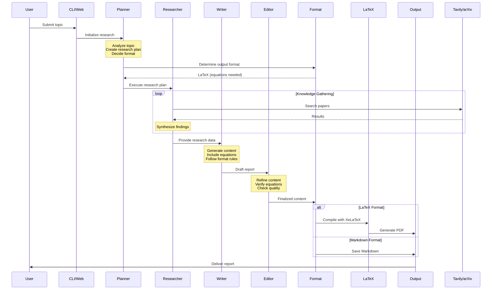

---

## 🧩 Multi-Agent Collaboration

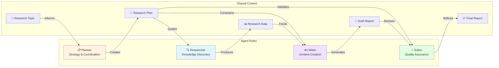

---

## 🎨 Format Decision Intelligence

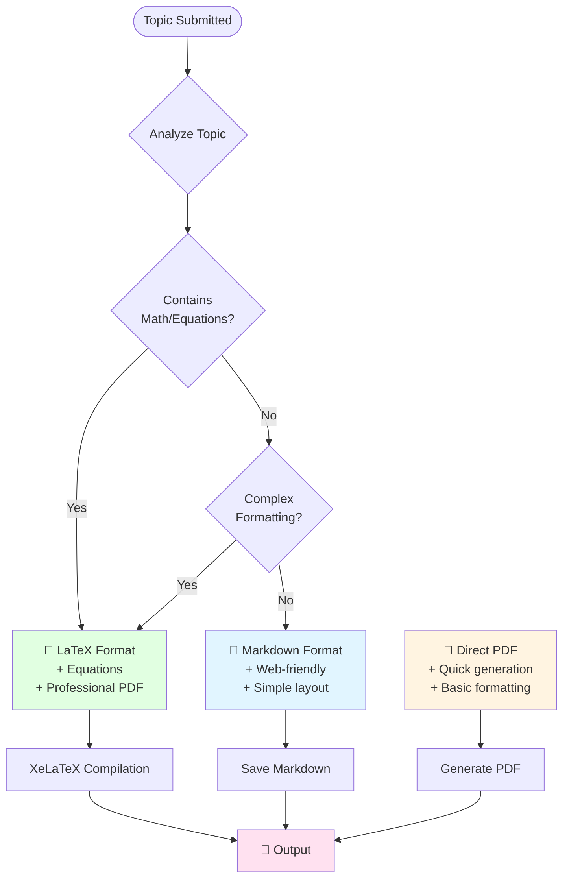

---

## 🔌 Tool Integration

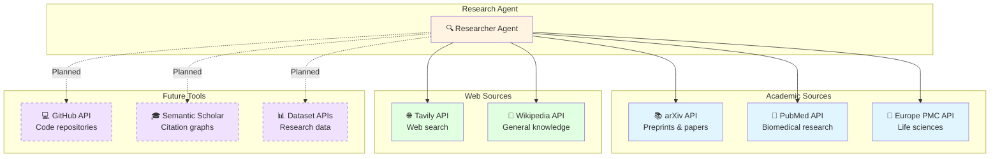

---

## 🚀 Future Architecture (Roadmap)

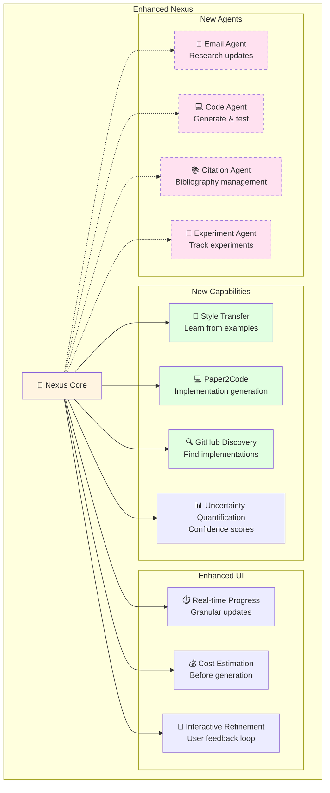

---

## 📊 Data Flow

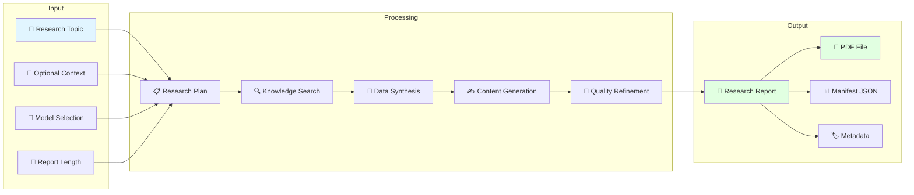

---

## 🎓 Design Patterns Illustrated

### Reflection Pattern
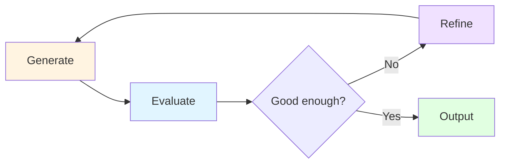

### Tool Use Pattern
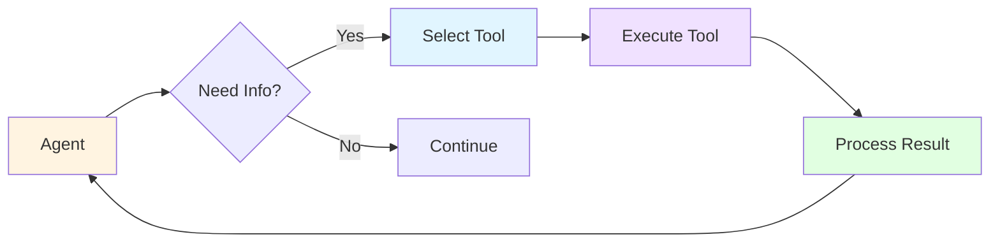

### Multiagent Pattern
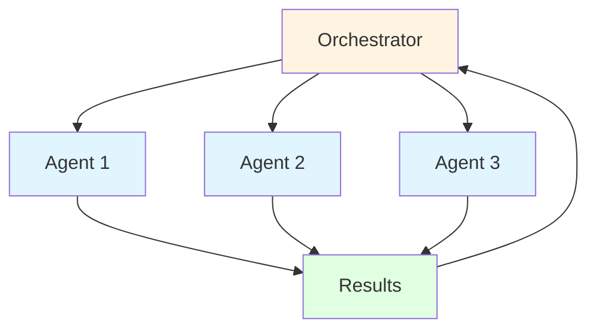

---

## 🔐 Configuration & Security

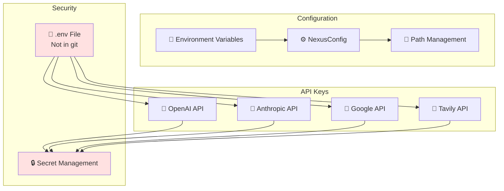

---

## 📈 Performance & Scalability

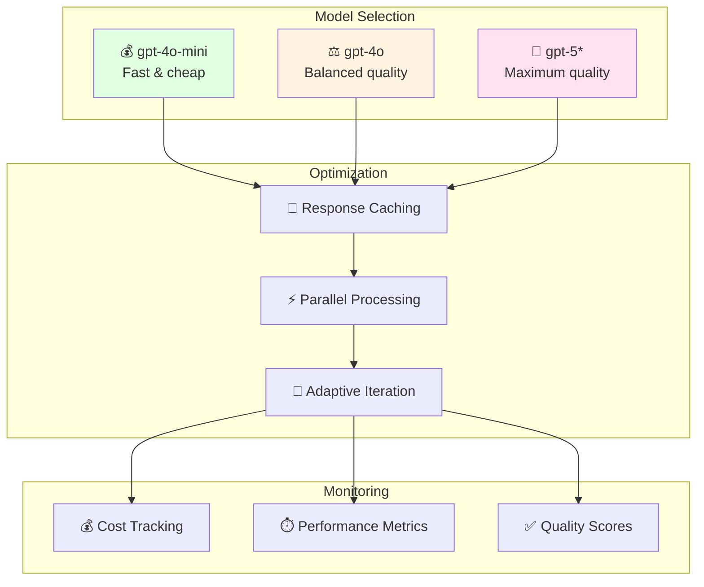

---

**Legend:**
- 🎯 Core System
- 🤝 Supporting Agents
- 🔧 External Tools
- 💾 Storage
- 🚀 Future/Planned (dashed lines)
- 🎨 Color coding by function type
