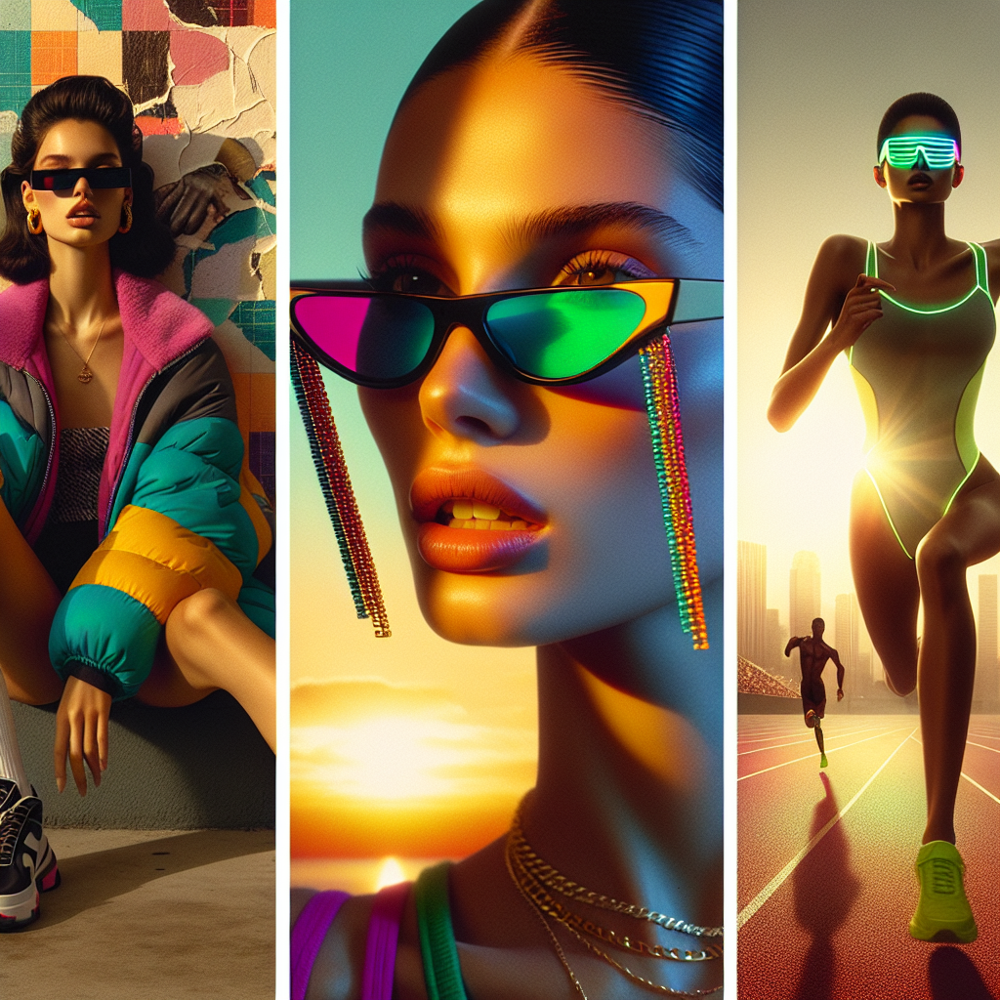

# 🕶️ Summer Sunglasses Campaign – Executive Summary

## 📊 Refined Trend Insights
Summer 2025 Eyewear Campaign: Trend-Driven Product Focus

As we prepare to launch our summer collection, we’ve distilled the season’s dominant style movements into three product pillars—each already in stock—to deliver a cohesive, high-velocity campaign that speaks to high-fashion, streetwear and performance audiences alike.

1. Key Trends  
 • Retro-Inspired Silhouettes (“’90s Cool Girl”): Oversized acetate frames, bold angles and cat-eye shapes are back in a big way, appealing to both nostalgia seekers and style-forward consumers.  
 • Sports-Inspired & Shield Styles: Wraparound lenses and streamlined contours are migrating from athleticwear into everyday wardrobes, marrying functionality with a futuristic edge.  
 • Color-Tinted Lenses & Novel Embellishments: From millennial pink tints to lens-to-chain pairings, personalized pops of color and playful accents are driving engagement and shareability.

2. Product Selections  
 • Wayfarer (SG002)  
   – Captures the retro chunky-frame trend with room for vibrant lens tints.  
   – Versatile enough to anchor both street-style and casual looks.  
 • Mystique (SG003)  
   – A modern cat-eye that bridges Y2K flair and ’50s glamour.  
   – Embellished temples ready for mini-chain or color-accent insertions.  
 • Sport (SG004)  
   – Full-coverage wraparound lens perfectly aligned with the athleisure and shield craze.  
   – Delivers performance-grade protection with a sleek, contemporary aesthetic.

3. Strategic Rationale  
By spotlighting these three styles—high-fashion (Mystique), everyday heritage (Wayfarer) and performance (Sport)—we ensure:  
 • Broad Market Reach: Engaging distinct consumer segments without diluting brand cohesion.  
 • Rapid Deployment: Leveraging existing inventory for immediate promotional readiness.  
 • Seasonal Resonance: Infusing summer energy through tinted finishes and accessory add-ons (chains, color pops), amplifying social media buzz and in-store excitement.

This lean, trend-to-product alignment positions us to execute a compelling Summer 2025 campaign that maximizes ROI, accelerates sell-through and reinforces our leadership in eyewear innovation.

## 🎯 Campaign Visual

    

## ✍️ Campaign Quote
Summer Shades: Retro Frames, Sporty Edge, Vibrant Tints

## ✅ Why This Works
This line captures the ’90s-inspired silhouettes, wraparound athletic profiles and color-tinted lenses showcased in the image, weaving retro cool, performance flair and playful hues into a unified summer campaign message.

---

*Report generated on 2025-11-20*
