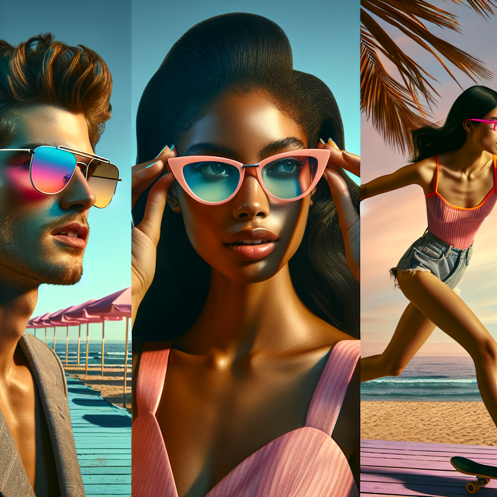

# 🕶️ Summer Sunglasses Campaign – Executive Summary

## 📊 Refined Trend Insights
Summer 2025 Eyewear Trends: Executive Summary

Overview  
As consumers seek both style and functionality this summer, three distinct eyewear trends are emerging. Our curated catalog aligns with these narratives to deliver broad market appeal and strong seasonal merchandising opportunities.

1. Emerging Trends  
– Color-Forward Tinted Lenses  
  Bright, single-tone or gradient lenses (millennial pink, amber, teal) inject a youthful, playful edge—ideal for beach days, music festivals and urban streetwear.  
– Modernized Cat-Eye Revival  
  Sleek ‘50s-inspired upswept frames in acetate with subtle metal accents or temple embellishments appeal to the aspirational “cool-girl” consumer.  
– Sport-Inspired Wraparounds  
  Single-lens silhouettes borrowed from cycling and skiing combine technical performance (lightweight frames, rubber grips, full coverage) with an athleisure aesthetic.

2. Catalog Alignment  
– SG001 “Aviator”  
  Classic metal teardrop ready for pastel- or gradient-tint customization.  
– SG003 “Mystique”  
  Contemporary cat-eye with refined temple details in seasonal acetate hues.  
– SG004 “Sport”  
  High-performance wraparound featuring rubberized grips and neon-trim options.

3. Strategic Rationale  
– Targets the three dominant style narratives of Summer 2025.  
– Enables tiered merchandising with on-trend finishes and colorways.  
– Expands reach across fashion-centric and performance-driven segments, maximizing ROI.

## 🎯 Campaign Visual

    

## ✍️ Campaign Quote
Embrace Summer: Colorful Tints, Cat-Eye Chic, Sporty Wraparounds

## ✅ Why This Works
This line spotlights the three key summer eyewear trends—bright tinted lenses, retro ’50s cat-eye frames, and athletic wraparound styles—while echoing the vibrant, beach-side imagery and playful, fashion-forward mood.

---

*Report generated on 2025-11-20*
